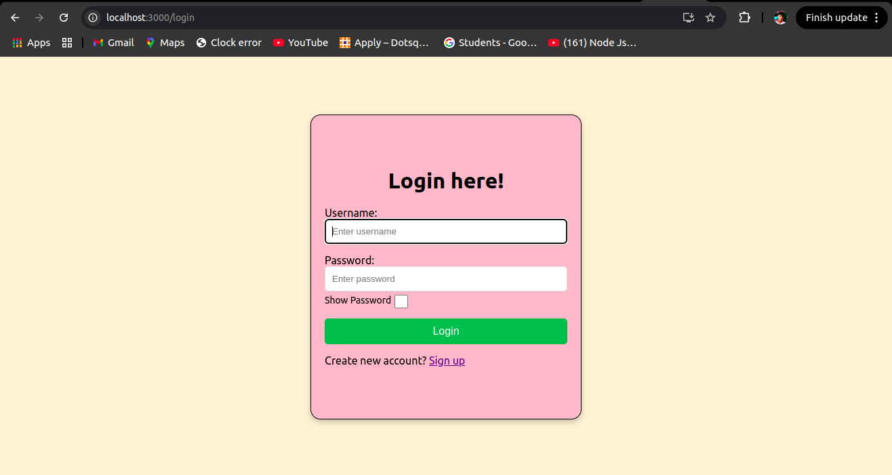
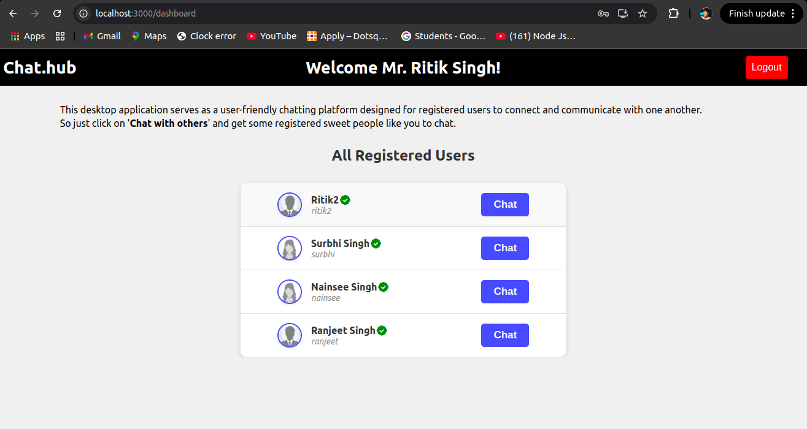
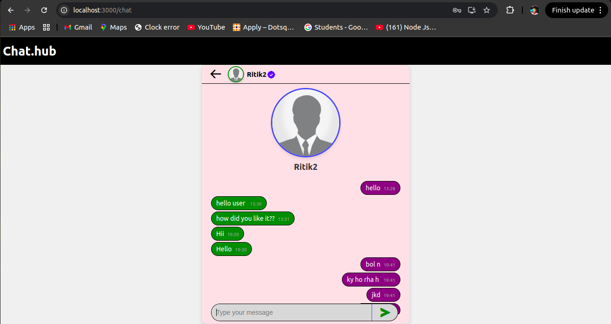

# 💬 MERN Real-Time Chat App

A full-stack real-time chat application built with the **MERN stack** (MongoDB, Express.js, React.js, Node.js) and **Socket.IO**. Users can register, log in, view all other users, and initiate one-on-one private chats.
<br>
<br>

## 🚀 Features

- ✅ User Registration & Login (with validation)
- ✅ Private One-on-One Messaging
- ✅ Real-Time Communication
- ✅ User List with "Chat" Buttons
- ✅ MongoDB for Data Persistence
- ✅ Simple, Responsive UI
<br>
<br>

## 📸 Screenshots





## 📂 Folder Structure

Chat_Hub/                                              <br>
│                                                      <br>
├── frontend/       # React frontend                   <br>
│ ├── public/                                          <br>
│ └── src/                                             <br>
│   ├── components/                                    <br>
│   ├── imgs/                                          <br>
│   ├── App.js                                         <br>
│   └── index.js                                       <br>
│   └── index.css                                      <br>
│ └── package.json  # Frontend metadata and scripts    <br>
│                                                      <br>
├── backend/        # Express backend                  <br>
│ ├── models/       # Mongoose schemas                 <br>
│ ├── routes/       # API endpoints                    <br>
│ ├── db.js         # Database connection              <br>
│ ├── package.json  # Backend metadata and scripts     <br>
│ └── server.js     # Entry point                      <br>
│                                                      <br>
├── .gitignore                                         <br>
├── package.json    # Project metadata and scripts     <br>
└── README.md       # You're reading it!               <br>
<br>
<br>

## 🧪 Tech Stack

**Frontend:**

- React.js
- HTML/CSS

**Backend:**

- Node.js
- Express.js
- MongoDB with Mongoose

<br>
<br>

## 🧱 Required Tech Stack & their Versions

<table width="500px">
  <thead>
    <th>Technology</th>
    <th>Version</th>
  </thead>
  <tbody>
    <tr>
      <td>Node.js</td>
      <td>20.19.0</td>
    </tr>
    <tr>
      <td>MongoDB</td>
      <td>8.0.1</td>
    </tr>
  </tbody>
</table>

<br>
<br>

## 🔧 Getting Started

**1. Clone the Repository**

```bash
git clone https://github.com/xritik/Chat_Hub.git
cd Chat_Hub
```
<br>
<br>

**2. Install Dependencies**

- **At Project Root:**

```bash
npm install
```

- **Frontend:**

```bash
cd ../frontend
npm install
```

- **Backend:**

```bash
cd backend
npm install
```
<br>
<br>

**3. Run the Application**
```bash
cd ../
npm start
```
<br>
<br>

## 🌐 Usage:

- Register or login with an existing account.
- Click "Chat with Others".
- Select a user and start chatting in real-time!
<br>
<br>

## 👨‍💻 Author
Developed with ❤️ by [Ritik](https://github.com/xritik).
