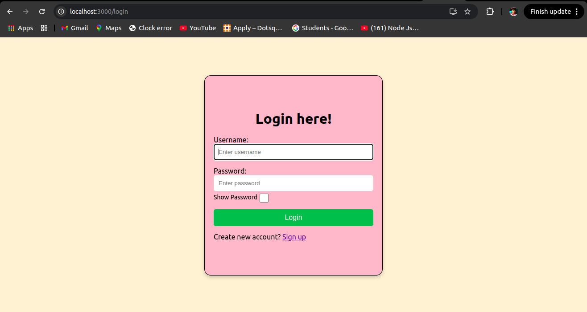
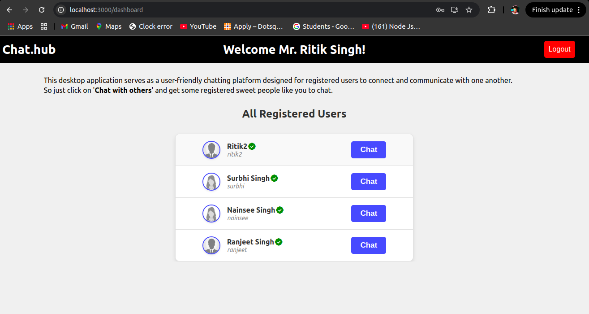
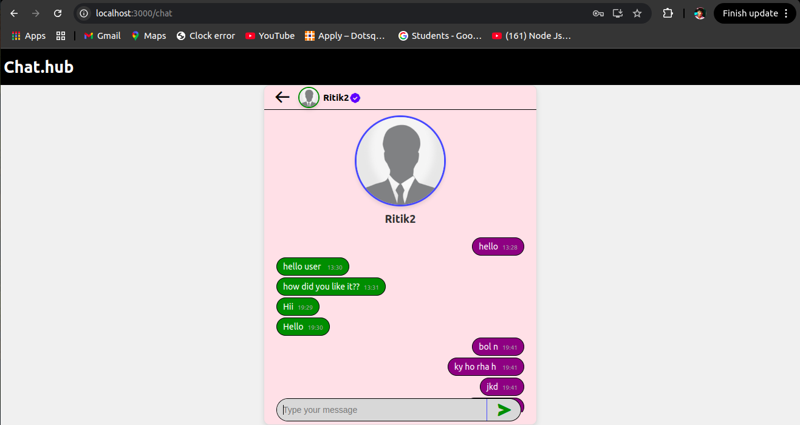

# 💬 ChatHub — Real-Time Chat Application

A full-stack, real-time private messaging app built with the MERN stack and WebSockets, featuring instant one-on-one communication, live connection management, and persistent message history.
<br>
<br>

## 🚀 Features

- ✅ User registration and login with input validation
- ✅ Instant one-on-one chat powered by WebSocket
- ✅ Browse all registered users and initiate chats
- ✅ All messages stored in MongoDB and loaded on open
- ✅ WebSocket client reconnects automatically on drop
- ✅ Server-side ping/pong to detect and clean dead connections
- ✅ Clean, mobile-friendly interface
<br>
<br>

## 📸 Screenshots
<br>

- **Login Page**

<br>

- **Dashboard Page**

<br>

- **Chatting Page**



<br>
<br>

## 🧪 Tech Stack

**Frontend:**

- React.js
- React Router
- WebSocket API (native)
- HTML/CSS

**Backend:**

- Node.js
- Express.js
- ws
- MongoDB + Mongoose
- dotenv
- cors

<br>
<br>

## 📂 Folder Structure

Chat_Hub/                                                <br>
│                                                        <br>
├── backend/          # Express backend                  <br>
│   ├── models/       # API endpoints                    <br>
│   │   ├── chats.js                                <br>
│   │   └── users.js                           <br>
│   ├── routes/       # Mongoose schemas                 <br>
│   │   ├── chatRoutes.js                                <br>
│   │   ├── dashboardRoutes.js                           <br>
│   │   ├── loginRoutes.js                               <br>
│   │   ├── signupRoutes.js                              <br>
│   │   └── userRoutes.js                                <br>
│   ├── .env          # For environment variable         <br>
│   ├── db.js         # Database connection              <br>
│   ├── package.json  # Backend metadata and scripts     <br>
│   └── server.js     # Entry point                      <br>
│                                                        <br>
│                                                        <br>
├── frontend/       # React frontend                     <br>
│   ├── public/                                          <br>
│   ├── src/                                             <br>
│   │   ├── components/                                  <br>
│   │   │   ├── Chat.js                                  <br>
│   │   │   ├── Dashboard.js                             <br>
│   │   │   ├── Login.js                                 <br>
│   │   │   ├── Missing.js                               <br>
│   │   │   └── SignUp.js                                <br>
│   │   ├── imgs/                                        <br>
│   │   ├── App.js                                       <br>
│   │   └── index.js                                     <br>
│   │   └── index.css                                    <br>
│   ├── package.json  # Frontend metadata and scripts    <br>
│   └── .env          # For environment variable         <br>
│                                                        <br>
├── .gitignore                                           <br>
├── package.json    # Project metadata and scripts       <br>
└── README.md       # You're reading it!                 <br>
<br>
<br>


## 🧱 Required Tech Stack & their Versions

<table width="500px">
  <thead>
    <th>Technology</th>
    <th>Version</th>
  </thead>
  <tbody>
    <tr>
      <td>Node.js</td>
      <td>20.19.0</td>
    </tr>
    <tr>
      <td>MongoDB</td>
      <td>8.0.1</td>
    </tr>
    <tr>
      <td>npm</td>
      <td>Comes with Node.js</td>
    </tr>
  </tbody>
</table>

<br>
<br>

## 🔧 Getting Started

**1. Clone the Repository**

```bash
git clone https://github.com/xritik/Chat_Hub.git
cd Chat_Hub
```
<br>
<br>

**2. Install Dependencies**

- **At Project Root:**

```bash
npm install
```

- **Backend:**

```bash
cd backend
npm install
```

- **Frontend:**

```bash
cd ../frontend
npm install
```
<br>
<br>


**3. Environment Variables**

Backend — backend/.env
```bash
MONGO_URI=mongodb+srv://<username>:<password>@cluster0.xxxxx.mongodb.net/mydb?retryWrites=true&w=majority
PORT=8080
```

Frontend — frontend/.env
```bash
REACT_APP_API_URL=https://chathub.onrender.com
REACT_APP_WS_URL=wss://chathub.onrender.com
```

**4. Run the Application**
```bash
cd ../
npm start
```
The app is [live here](https://richat7.vercel.app).
<br>
<br>

## 🌐 Usage:

- Open https://richat7.vercel.app in your browser.
- Register or login with an existing account.
- From the dashboard, click "Chat with Others".
- Select any registered user from the list.
- Start sending messages in real time — both sides update instantly!
<br>
<br>